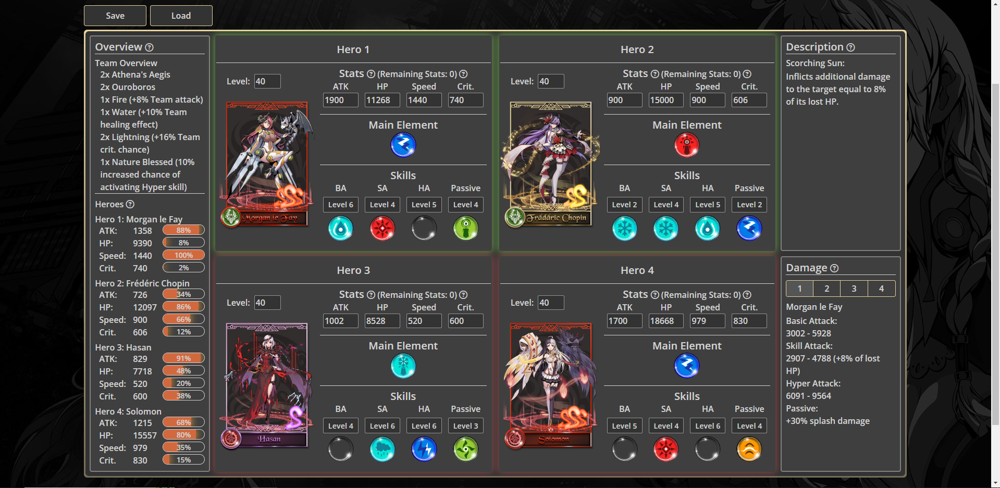
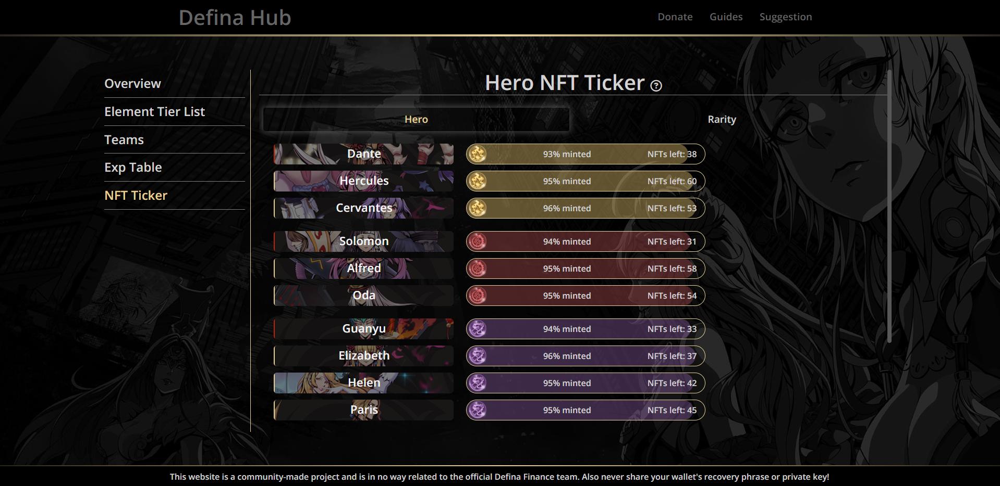
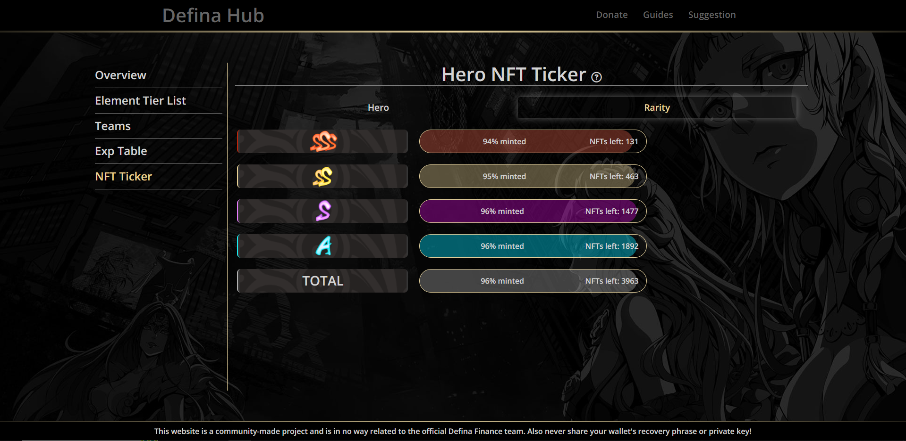

# Defina Hub

This repository is the backend for the definahub.com website.
(NOTICE: The website doesn't exist anymore because it became obsolete with the newest V2 Defina Update)

Definahub is a personal project for the game Defina.Finance to help the community calculate their Hero NFT stats in an easy way.
It also lets you check the remaining amount of each hero NFT and rarity to be minted from the V1 NFT mystery boxes.
Or you can just check other miscellaneous information about the game.

## Setup locally

Run `npm install` after cloning this repo. With `npm run dev` you run the backend locally on localhost:3000.

## Preview

